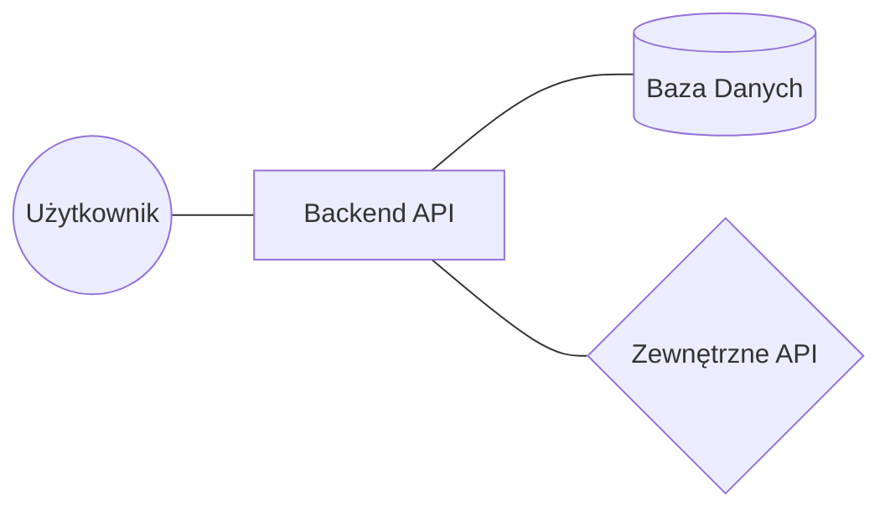
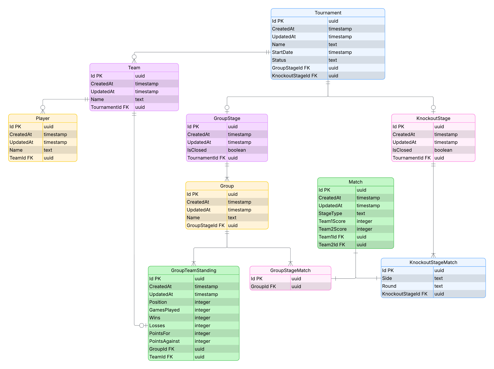
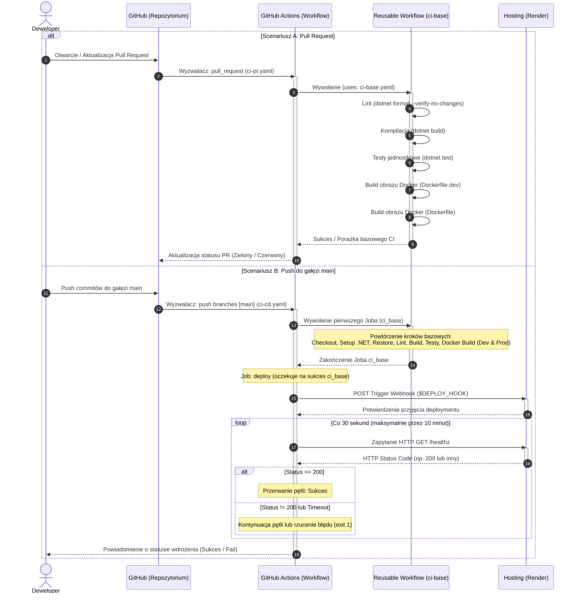
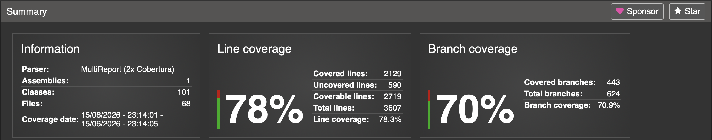

# Raport Końcowy z Projektu

**Przedmiot:** Integracja Systemów Informatycznych

**Nazwa Projektu:** EsportHub

**Skład Zespołu:** Miłosz Samotyjak

**Link do repozytorium:** [github.com/Me-Wosh/EsportHub](https://github.com/Me-Wosh/EsportHub)

**Link do wersji LIVE:** [esporthub.onrender.com](https://esporthub-lpx3.onrender.com)

---

## 1. Opis Projektu

EsportHub to backendowe REST API do zarządzania turniejem e-sportowym. System obsługuje pełny cykl życia rozgrywek - od rejestracji drużyn i zawodników, przez fazę grupową, aż po fazę pucharową i finał. Aplikacja integruje się z platformą Twitch, umożliwiając tworzenie klipów oraz zarządzanie harmonogramem transmisji na żywo. Integracja jest dodatkową funkcjonalnością aplikacji a sama aplikacja nie jest zależna od tej integracji - główne funkcjonalności aplikacji dalej działają w wypadku przerwania działania Twitch API. System rozwiązuje problem jednoczesnego zarządzania turniejem i transmisjami na żywo które są nieodłączną częścią rozgrywek. Udostępnia wygodne, pojedyczne narzędzie do zarządzania obydwoma tymi aspektami zamiast wymuszać na użytkowniku naukę obsługi dwóch lub więcej systemów.

### 1.1. Zakres Funkcjonalny

Funkcjonalności:
- tworzenie i zarządzanie drużynami oraz składami zawodników,
- tworzenie turniejów i obsługa ich pełnego cyklu: faza grupowa -> faza pucharowa,
- ustawianie wyników meczów z automatycznym wyznaczaniem zwycięzcy,
- integracja z Twitch API: autoryzacja OAuth 2.0, tworzenie klipów (krótkich filmów obejmujących część transmisji która upłynęła na kilkadziesiąt sekund przed zgłoszeniem prośby utworzenia klipu) oraz harmonogramów transmisji.

Wymagane funkcjonalności:
- [x] Funkcjonalność A (CRUD)
- [x] Funkcjonalność B (Integracja z zewnętrznym API: Twitch API)
- [x] Funkcjonalność C (Zadanie dodatkowe/inżynierskie: niewymagane ale zrealizowane. Authentication Extra: Logowanie przez zewnętrzne serwisy (OAuth2 - Twitch))

## 2. Architektura Systemu

Aplikacja zbudowana jest jako warstwowe REST API w oparciu o ASP.NET Minimal API. Warstwa prezentacji (endpointy) jest celowo cienka - każdy handler deleguje wywołanie do obiektu komendy lub zapytania przez mediator (biblioteka MediatR), a cała logika biznesowa mieszka w handlerach warstwy aplikacji (`Features/`) oraz w bogatej warstwie domenowej (`Domain/`).

Domain-Driven Design z bogatą domeną - encje nie są pasywnym pojemnikiem na dane. Agregaty i encje posiadają własne niezmienniki i udostępniają wyłącznie operacje, które utrzymują je w poprawnym stanie. Konstruktory są prywatne lub chronione; obiekty tworzone są przez statyczne metody fabryczne zwracające `Result<T>`, dzięki czemu niemożliwe jest stworzenie encji w niepoprawnym stanie.

Result Pattern zamiast wyjątków - warstwa domenowa, aplikacyjna i webowa posługują się typem `Result<T>` (biblioteka Ardalis.Result) jako pierwszorzędnym typem zwracanym dla operacji, które mogą się nie powieść. Błędy są częścią sygnatury metody, a filtr endpointu `ArdalisResultMapper` automatycznie tłumaczy status wyniku na odpowiedni kod HTTP.

Mediator Pattern w endpointach - endpointy (`Endpoints/`) odbierają żądanie HTTP, mapują je na obiekt komendy lub zapytania i natychmiast przekazują do mediatora. Warstwa webowa nie zawiera żadnej logiki biznesowej i nie wymaga osobnych testów jednostkowych.

### 2.1. Diagram Architektury



### 2.2. Stos Technologiczny

- **Backend:** ASP.NET 10 Minimal API,
- **Baza danych:** PostgreSQL 18,
- **ORM:** Entity Framework 10,
- **Result Pattern**,
- **konteneryzacja:** Docker + Docker Compose,
- **wdrożenie:** Render.com

### 2.3. Model Danych (Diagram ERD)



### 2.4. Zgodność z Twelve-Factor App

Wybrane punkty Twelve-Factor App:
- Codebase - stworzono jedno repozytorium GitHub ze zmianami śledzonymi za pomocą Gita z wieloma i automatycznymi wdrożeniami,
- Config - konfiguracje i sekrety są przechowywane w pliku `.env` lub User Secrets, nic nie jest na sztywno zaprogramowane w kodzie, jak np. Twitch Client Secret lub Connection String do bazy danych,
- Build, release, run - `Dockerfile` wyraźnie wydziela proces budowania aplikacji, jej publikowania i uruchamiania,
- Dev/prod parity - aplikacja zachowuje się tak samo w środowisku deweloperskim i produkcyjnym, wykorzystuje te same zmienne środowiskowe, które różnią się jedynie częścią związaną z hostami.

## 3. Realizacja CI/CD i Jakość Kodu

### 3.1. Pipeline CI (GitHub Actions)

Skonfigurowane zostały 3 workflowy. Wspólna logika wyodrębniona jest do workflowu wielokrotnego użytku `ci-base.yaml`, który jest wywoływany przez pozostałe dwa.

**Workflow bazowy `ci-base.yaml` - uruchamiany przy każdym PR i pushu do `main`:**

```yaml
name: CI base

on:
  workflow_call:

jobs:
  ci_base:
    runs-on: ubuntu-latest

    steps:
      - uses: actions/checkout@v5
      
      - name: Set up .NET
        uses: actions/setup-dotnet@v4
        with:
          dotnet-version: 10.0.x
          cache: true
          cache-dependency-path: EsportHub.Backend/EsportHub.Backend.slnx
      
      - name: Install dependencies
        run: dotnet restore EsportHub.Backend/EsportHub.Backend.slnx
      
      - name: Lint
        run: dotnet format EsportHub.Backend/EsportHub.Backend.slnx --verify-no-changes --no-restore
      
      - name: Build
        run: dotnet build EsportHub.Backend/EsportHub.Backend.slnx --no-restore
      
      - name: Run tests
        run: dotnet test EsportHub.Backend/EsportHub.Backend.slnx --no-build
      
      - name: Set up Docker Buildx
        uses: docker/setup-buildx-action@v4
      
      - name: Build development image without push
        uses: docker/build-push-action@v7
        with:
          context: EsportHub.Backend
          file: EsportHub.Backend/Dockerfile.dev
          push: false # Only check if build succeeds and ignore build result
          cache-from: type=gha
          cache-to: type=gha,mode=max

      - name: Build production image without push
        uses: docker/build-push-action@v7
        with:
          context: EsportHub.Backend
          file: EsportHub.Backend/Dockerfile
          push: false
          cache-from: type=gha
          cache-to: type=gha,mode=max
```

Kroki w kolejności:
1. `dotnet restore` - instalacja/przywrócenie bibliotek,
2. `dotnet format --verify-no-changes` - linter, build kończy się błędem przy niezgodności,
3. `dotnet build` - kompilacja,
4. `dotnet test` - uruchomienie testów,
5. Docker build - weryfikacja czy deweloperski i produkcyjny obraz Docker buduje się poprawnie, bez publikowania i zapisywania wyniku.



### 3.2. Testy i Pokrycie Kodu

- **Rodzaje testów:** jednostkowe, integracyjne,
- **Narzędzie do pokrycia:** coverlet.collector,
- **Wynik pokrycia:** 78%



### 3.3. Statyczna Analiza Kodu

Zostało użyte polecenie `dotnet format` wbudowane w ekosystem poleceń `dotnet`.

### 3.4. Deployment (CD)

Wdrożenie na platformę render.com uruchamiane jest automatycznie po każdym pushu do gałęzi `main`, po pomyślnym zakończeniu CI:

```yaml
name: EsportHub CI/CD

on:
  push:
    branches: [main]

jobs:
  ci_base:
    uses: ./.github/workflows/ci-base.yaml
  
  deploy:
    needs: ci_base
    runs-on: ubuntu-latest

    steps:
      - name: Deploy to Render
        env:
          DEPLOY_HOOK: ${{ secrets.RENDER_DEPLOY_HOOK_URL }}
        run: |
          curl -X POST "$DEPLOY_HOOK"

      - name: Deployment health check
        timeout-minutes: 10
        run: |
          URL="https://esporthub-lpx3.onrender.com/healthz"
          TIMEOUT=600
          INTERVAL=30
          ELAPSED=0
          
          while [ $ELAPSED -lt $TIMEOUT ]; do
            sleep 30

            STATUS=$(curl -s -m 5 -o /dev/null -w "%{http_code}" $URL || true)
            if [ $STATUS -eq 200 ]; then
              exit 0
            fi

            ELAPSED=$((ELAPSED + INTERVAL))
          done

          exit 1
```

1. deploy hook wysyła żądanie POST do Render.com, które inicjuje wdrożenie nowej wersji aplikacji,
2. health check sprawdza co 30 sekund endpoint `/healthz` aplikacji, czekając maksymalnie 10 minut na pomyślną odpowiedź. Jeśli aplikacja nie uruchomi się w tym czasie, krok kończy się błędem,
3. `RENDER_DEPLOY_HOOK_URL` przechowywany jest jako GitHub Actions Secret - nie jest widoczny w kodzie repozytorium.

## 4. Zarządzanie Projektem (Git/GitHub)

- **Workflow:** GitHub Actions workflow, każda funkcjonalność rozwijana na osobnej gałęzi feature, mergowana do `main` przez Pull Request. Brak możliwości mergowania PR dla CI zakończonego niepowodzeniem. Zarządzanie zadaniami przez GitHub Issues i GitHub Projects,
- **Code Review:** Projekt realizowałem samodzielnie więc proces opierał się na samodzielnej weryfikacji każdego commita - czy wszystkie punkty zadania zostały spełnione i czy można coś usprawnić. [Przykładowy PR](https://github.com/Me-Wosh/EsportHub/pull/12).
- **Konwencja Commitów:** Brak oficjalnej konwencji, każdy commit w jednym, krótkim zdaniu opisuje co zostało dodane i zmienione.

## 5. Dokumentacja API

[openapi.json](./openapi.json)

## 6. Podsumowanie i Wnioski

**Co udało się zrealizować:**
- kompletne REST API z obsługą pełnego cyklu turnieju e-sportowego,
- bogata warstwa domenowa z regułami biznesowymi i Result Pattern,
- pełny pipeline CI/CD: linter, build, testy, Docker build, automatyczne wdrożenie na Render.com,
- integracja z zewnętrznym API (Twitch OAuth 2.0, klipy, harmonogram transmisji),
- konteneryzacja zarówno dla środowiska produkcyjnego (wieloetapowy Dockerfile), jak i deweloperskiego (hot reload przez `dotnet watch`).

**Główne wyzwania:**
- zaprojektowanie bogatej domeny z regułami biznesowymi, decyzje jak przebiegają przepływy w aplikacji i która odpowiedzialność należy do którego agregatu,
- integracja z platformą Twitch - przestudiowanie dokumentacji i implementacja uwierzytelniania za pomocą Twitch OAuth,
- konfiguracja środowiska deweloperskiego działającego w Dockerze - podpięcie debugera pod działający kontener i hotreloading zmian w kontenerze.

**Plany na dalszy rozwój:**
- implementacja systemu autentykacji i autoryzacji,
- statystyki (drużyny, gracza).

**Wnioski z integracji:**
- integracja przebiegła pomyślnie, bez większych problemów.
